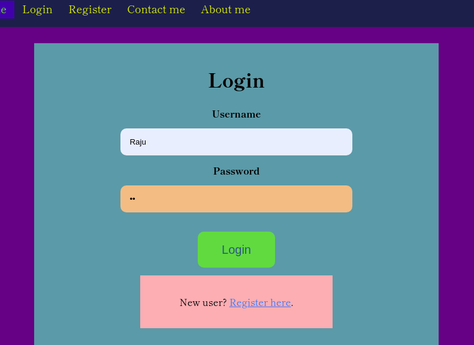
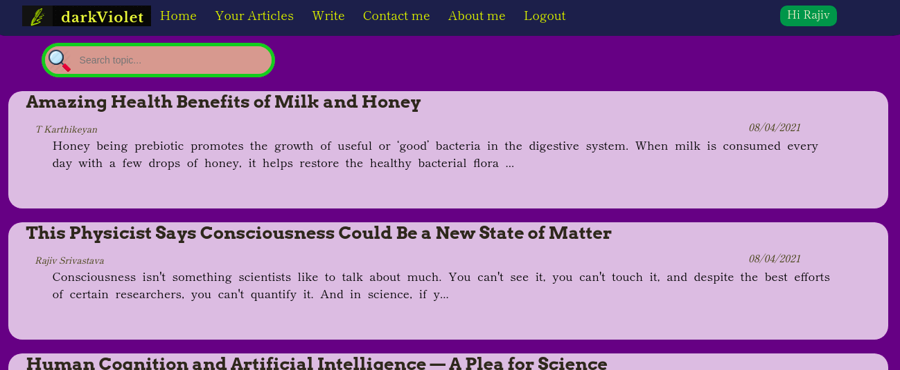
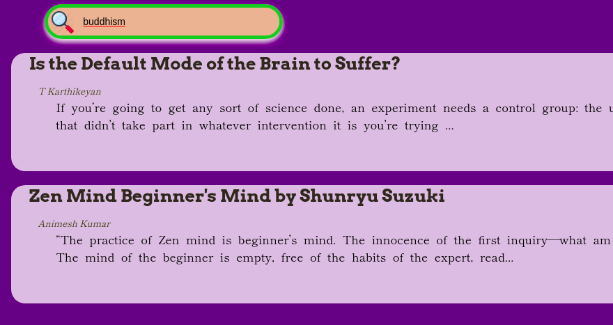
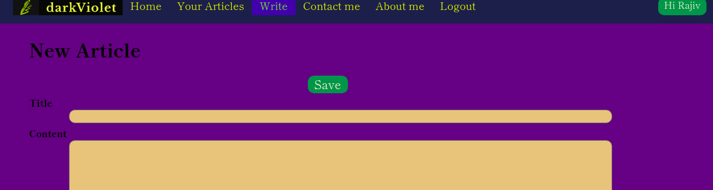
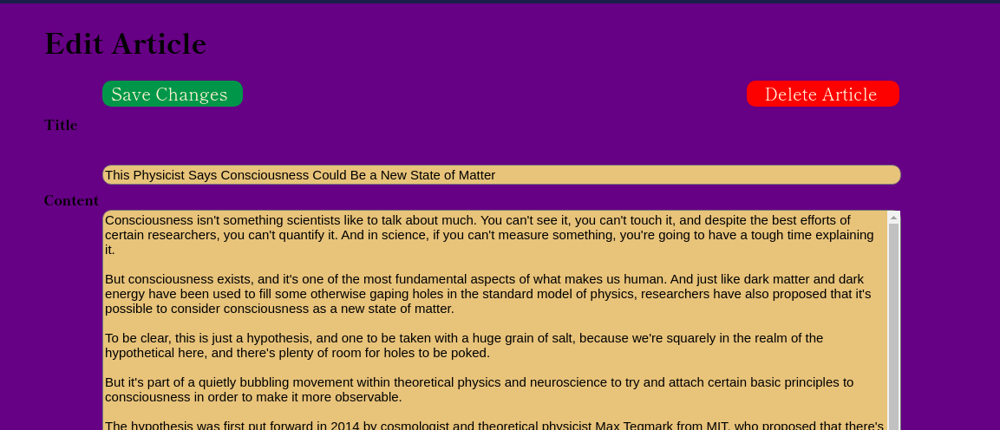
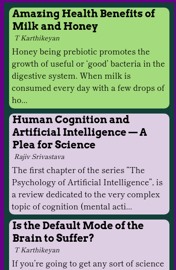
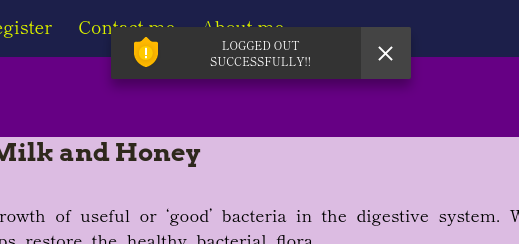
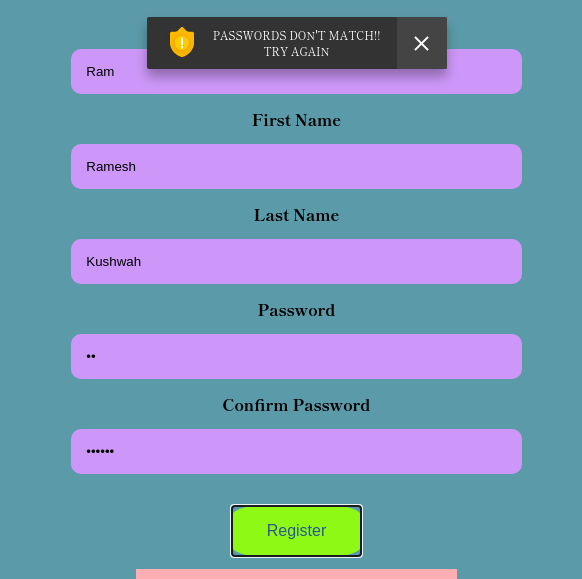

# darkViolet Web Application

_A "single-page-web-application" platform to share your ideas, views and interesting topics by writing articles built to provide seemless experience using React.js and backend using Django framework._

### Table of contents
* [Introduction](#introduction)
* [Functionalities](#functionalities)
* [Technical Details](#technical-details)
* [Visit the web app](#visit-the-web-app)
* [Contact developer](#contact-developer)

### Introduction
darkViolet is created to connect with people by writing articles and letting others know about it. This platform can be used to write new articles and manage them i.e. editing them online and deleting the unwanted articles you wrote. All this is done in a simple, easy and smooth user interface created using React.js library of Javascript. Your articles will be saved and secured on our database and only you will be able to modify it. So, hop on to [link1](http://13.233.125.44/ "darkViolet") or [link2](http://darkviolet.pythonanywhere.com/ "darkViolet"), register and start sharing your ideas NOW!!
___

### Functionalities
* Author authentication system(JWT based)
    

* Article Listing
    

* Fully functional Article Searching based upon the topic
    

* Write New Article
    

* Author's articles page
    

* Edit or delete the existing articles
    

* Article display page using crisp colours to help reading smooth.
    

* Quickly open a new article suggested
    

* Proper alert system based upon status of the application
    * On logout
    

* Validating data input right at the frontend
    * On Invalid data input
    
___

### Technical Details
#### Frontend
* Frontend purely made of [React.js](https://reactjs.org/) library of `Javascript`
* A Single Page Application design completely using `React hooks`
* `container` and `component` based architecture
* [react-router-dom](https://reactrouter.com/) for handling routing through the application
* AJAX using [axios](https://www.npmjs.com/package/axios) for making API calls to the backend server
* Proper state and props management for conditional rendering based upon the logged in author
* Using `localStorage` for [JSON Web Token(JWT)](https://jwt.io/) based authentication.

#### Backend
* [Django framework](https://www.djangoproject.com/) based on python3
* REST API endpoints using [django-rest-framework](https://www.django-rest-framework.org/)
* SQLite Database
* Token based authentication for `author`s using [Simple JWT](https://django-rest-framework-simplejwt.readthedocs.io/en/latest/)
* Superuser access to me keep an eye on the kind of blogs being posted

This app is created as a single page application in such a way that it can give a smooth and seemless experience to both the reader and the author. **I had deployed it using `apache2` server on an AWS EC2 instance but due to finanical reasons I have also deployed it using pythonanywhere on web.**
___

### Visit the web app
* [darkViolet *(deployed on AWS EC2 on `apache2` server)*](http://13.233.125.44/ "darkViolet1")
* [darkViolet *(deployed on pythonanywhere)*](http://darkviolet.pythonanywhere.com/ "darkViolet2")

___
### Contact developer
                
#### Animesh Kumar

email: 24animesh11@gmail.com 

phone: +91 7985851496 

<!-- Task List -->
* [x] React.js
* [X] AJAX
* [x] AWS EC2
* [x] Apache2
* [x] Django
* [x] Django REST framework
* [x] Database schema design
* [x] Algorithms analysis
* [x] Full-Stack Web development
* [x] Python Development
* [x] Windows, Linux OS
* [x] Multithreaded programming in C
* [x] Multiprocessing using C on linux
* [x] Image processing using OpenCV

___
_Spread love, Spread life_